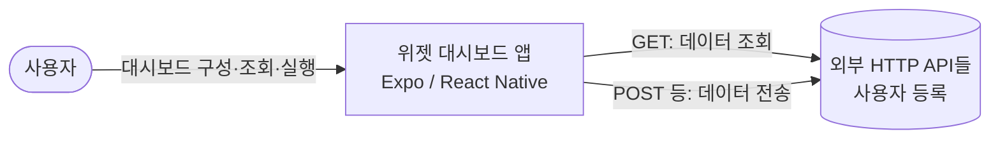
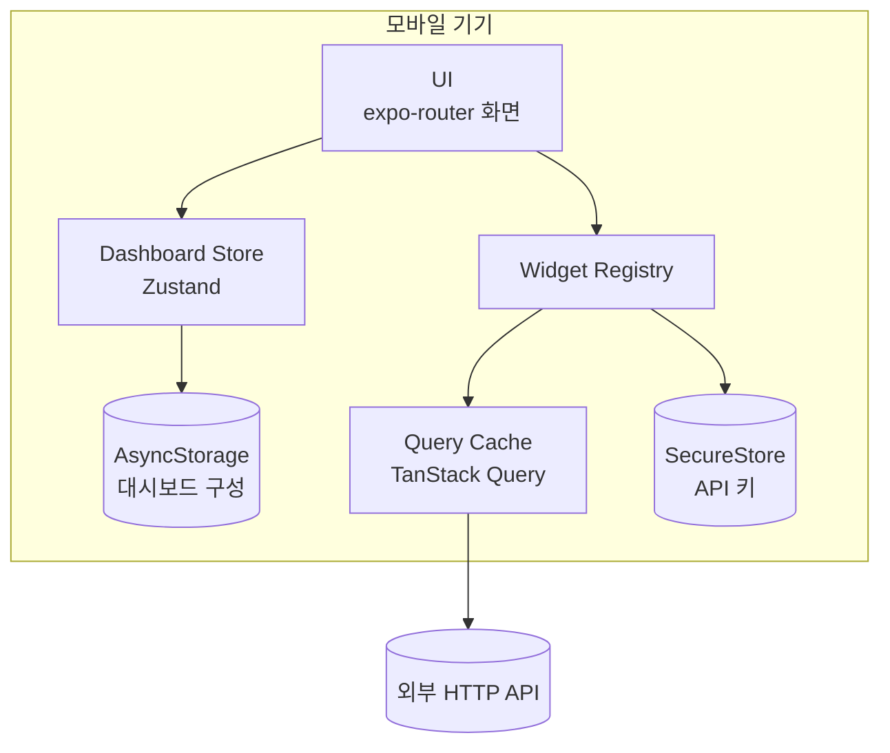

# C4 다이어그램 (L1, L2)

## L1 — System Context

```mermaid
flowchart LR
  user([사용자])
  app[위젯 대시보드 앱<br/>Expo / React Native]
  apis[(외부 HTTP API들<br/>사용자 등록)]
  user -- 대시보드 구성·조회·실행 --> app
  app -- GET: 데이터 조회 --> apis
  app -- POST 등: 데이터 전송 --> apis
```

## L2 — Container (앱 내부)

```mermaid
flowchart TB
  subgraph device[모바일 기기]
    ui[UI<br/>expo-router 화면]
    dash[Dashboard Store<br/>Zustand]
    reg[Widget Registry]
    query[Query Cache<br/>TanStack Query]
    async[(AsyncStorage<br/>대시보드 구성)]
    secure[(SecureStore<br/>API 키)]
  end
  apis[(외부 HTTP API)]

  ui --> dash
  ui --> reg
  dash --> async
  reg --> query
  reg --> secure
  query --> apis
```
