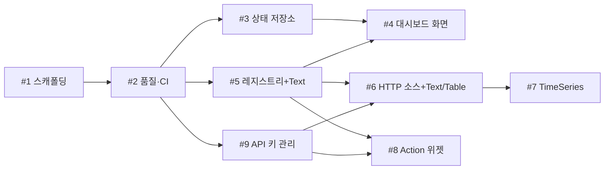

# 리포트: 개발 진행 계획 (M0 → M1)

- 작성: 2026-09-17
- 기준: SRS v0, GitHub 이슈 #1~#9 (모두 Open), PR #10 머지 완료

## 1. 요약
- 요구사항 9개를 **4단계**로 진행한다: 기반(#1, #2) → 뼈대(#3, #5) → 화면·보안(#4, #9) → 데이터 위젯(#6, #7, #8).
- `loop` 자동 처리에 적합한 이슈는 **#3, #5, #8**. 실기기 확인이나 설계 판단이 필요한 이슈는 대화형으로 진행한다.
- 착수 전 **결정 필요 4건**(6장)과 **SRS 보완 2건**(5장)이 있다.

## 2. 현황
| 이슈 | SRS | 제목 | 마일스톤 | 상태 |
|---|---|---|---|---|
| #1 | SRS-001 | Expo 앱 스캐폴딩 | M0 기반 | Open |
| #2 | SRS-002 | 품질 도구 및 CI | M0 기반 | Open |
| #3 | SRS-010 | 대시보드 상태 저장소 | M1 MVP | Open |
| #4 | SRS-011 | 대시보드 화면 | M1 MVP | Open |
| #5 | SRS-012 | 위젯 레지스트리 + Text 위젯 | M1 MVP | Open |
| #6 | SRS-013 | HTTP JSON 데이터 소스 + Text/Table 뷰 | M1 MVP | Open |
| #7 | SRS-014 | TimeSeries 뷰 | M1 MVP | Open |
| #8 | SRS-015 | HTTP Action 위젯 | M1 MVP | Open |
| #9 | SRS-016 | API 키 관리 화면 | M1 MVP | Open |

- 진행률: M0 0/2, M1 0/7

## 3. 의존 관계

| 이슈 | 선행 이슈 | 이유 |
|---|---|---|
| #2 | #1 | 설정할 프로젝트가 있어야 함 |
| #3, #5, #9 | #2 | 테스트·CI가 있어야 AC(단위 테스트) 검증 가능 |
| #4 | #3, #5 | 저장소에 위젯을 넣고, 레지스트리에서 타입 목록을 가져옴 |
| #6 | #5, #9 | 레지스트리에 뷰 등록, 헤더에 API 키 참조 |
| #7 | #6 | HTTP 데이터 소스 재사용 |
| #8 | #5, #9 | 레지스트리 등록, 요청에 API 키 참조 |

## 4. 단계별 계획

| 단계 | 이슈 | 목표 | 진행 방식 | 완료 신호 |
|---|---|---|---|---|
| 1. 기반 | #1 → #2 | 폰에서 앱이 뜨고, PR마다 CI 자동 검사 | **대화형** (#1은 실기기 확인 필요) | 폰 Expo Go 실행 + CI ✅ |
| 2. 뼈대 | #3, #5 | 위젯 데이터 구조와 확장 구조 확정 | **loop 후보** (서로 독립, 단위 테스트로 검증) | 단위 테스트 통과 |
| 3. 화면·보안 | #4, #9 | 위젯 추가/삭제 화면, 키 보관 | **대화형** (UX 확인, 보안 민감) | 폰에서 위젯 추가·삭제 |
| 4. 데이터 위젯 | #6 → #7, #8 | 실제 API 표출·전송 | #6·#7 대화형(실기기), #8 **loop 후보** | PRD 성공 기준 충족 |

- 단계 2의 #3, #5는 둘 다 #2만 선행이라 **첫 loop 실험 대상으로 적합**하다.
- 단계 4 종료 = PRD 5장 성공 기준(공개 API를 텍스트·테이블·그래프로 표시 + 전송 1건 성공) = **M1 MVP 완료**.

## 5. SRS 보완 필요 (구현 전 반영 권장)
1. **위젯 설정 편집 UI가 어느 이슈에도 명시되지 않음.**
   UF-01은 "설정 입력(URL·경로·뷰 형식)"을 요구하지만, SRS-011은 추가·삭제·이동만, SRS-012는 `ConfigEditor` 인터페이스만 정의한다.
   → SRS-011 AC에 "추가 시 해당 타입의 ConfigEditor로 설정 입력" 추가 제안.
2. **위젯 단위 오류 격리(Error Boundary)가 누락됨.**
   arc42 8장 공통 규칙이지만 SRS에 없다.
   → SRS-012 AC에 "한 위젯 렌더 오류가 다른 위젯에 영향 없음" 추가 제안.

## 6. 결정 필요 사항
| # | 결정 | 필요 시점 | 제안 |
|---|---|---|---|
| D1 | 테스트용 공개 API 선정 (PRD 오픈 이슈) | #6 전 | 인증 불필요 JSON API 1개 + 인증 헤더 테스트용 1개 |
| D2 | 값 추출 경로 문법 | #6 전 | MVP는 점 표기(`data.items[0].price`), JSONPath는 필요 시 ADR로 확장 |
| D3 | main 브랜치 보호 규칙 (PR 필수, CI 통과 필수) | #2 직후 | 적용. AI의 main 직접 push를 설정으로 차단 |
| D4 | 이슈 본문에 `선행 이슈` 항목 추가 | loop 도입 전 | 적용. loop가 순서를 스스로 판단하는 근거 |

## 7. 리스크
| 리스크 | 영향 | 대응 |
|---|---|---|
| Expo SDK·라이브러리 버전 호환 | #1, #7 지연 | `npx expo install`로 호환 버전 설치 |
| gifted-charts 한계 | #7 재작업 | View 추상화(ADR-0003)로 교체 범위 제한 |
| 실기기 확인이 사람 병목 | loop 효율 저하 | 실기기 AC가 있는 이슈는 loop 대상에서 제외 |
| 머지 대기로 후속 이슈 정체 | loop 중단 | 독립 이슈끼리 묶어 loop 실행 ([loop 체계 검토](2026-09-17-loop-dev-system.md)) |

## 8. 다음 행동
1. D1~D4 결정
2. #1 대화형 착수

## 갱신 (2026-09-17)
- **#1 완료** (PR #12 머지): Expo SDK 57 스캐폴딩, 폰 Expo Go 표시 확인. 진행률 M0 1/2.
- 머지 병목을 줄이기 위해 `CLAUDE.md`에 **머지 등급**(🟢 자체 머지 / 🟡 사용자 머지 / 🔴 사전 확인) 도입. 문서만 바뀐 PR은 Claude가 머지한다.
- 다음: #2 품질 도구·CI. D1~D4는 여전히 미결.
