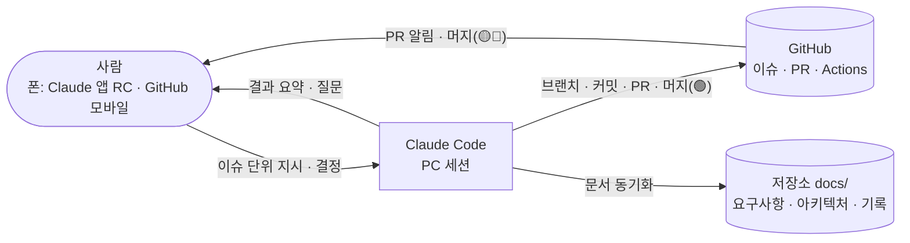

# 리포트: AI 주도 1인 개발 관리 체계 플레이북 (타 프로젝트 차용용)

- 작성: 2026-09-17
- 상태: 확정(운영 중). Stop 훅 동작 확인 2026-09-18
- 범위: 이 저장소의 **관리·진행 방식만** 정리한다. 제품 내용(도메인, 기능)은 다루지 않는다.
- 대상: Claude Code + GitHub로 1인(또는 소규모) 프로젝트를 운영하려는 다른 프로젝트

## 1. 요약
- **사람은 결정과 확인, AI는 실행과 기록.** 사람은 주로 폰에서 지시·검토하고, PC의 Claude Code가 구현부터 형상관리·문서화까지 끝까지 처리한다.
- 핵심 장치 5가지
  1. **추적 가능한 요구사항 3단**: NB(니즈) → PRD(무엇을) → SRS(어떻게, AC 포함) → GitHub 이슈 → PR
  2. **최소 아키텍처 문서**: ADR + arc42 필요 섹션만 + C4 L1/L2 (Mermaid)
  3. **머지 등급**: 🟢 AI 자체 머지 / 🟡 사람 머지 / 🔴 사전 확인 → 사람의 머지 부담을 줄임
  4. **자동 형상관리**: 프로젝트 스킬(commit·issue·report·journal·learn) + Stop 훅으로 커밋·push·일지 누락 방지
  5. **기록 3종**: 일간 일지(+개발자 퀵 가이드), 학습 노트, 리포트
- 차용 방법: 8장의 **부트스트랩 프롬프트**를 새 저장소에서 Claude Code에 붙여넣으면 같은 체계를 세팅한다.

## 2. 역할 구조



| 주체 | 하는 일 | 하지 않는 일 |
|---|---|---|
| 사람 | 요구사항 결정, 🟡🔴 PR 머지, 실기기·UX 확인, 로그인 등 계정 작업 | 반복적인 커밋·문서 정리 |
| Claude Code | 구현, 검증, 커밋·push·PR, 🟢 머지, 일지·학습 노트·리포트·추적표 갱신 | 범위 밖 작업, 규칙·보안 변경 임의 적용 |
| GitHub | 이슈(할 일), PR(검토 단위), 라벨·마일스톤(분류·진행률), CI, 비밀 값 차단 | — |

## 3. 구성 요소

### 3.1 요구사항 추적 (NB → PRD → SRS)
| 문서 | 성격 | 관리 주체 | 규칙 |
|---|---|---|---|
| `NB.md` Needs Backlog | 형식 없는 니즈 덤프 | 사람(말하면 AI가 적재) | 상태 `new/promoted/hold/dropped`, 승격 시 `→ PRD-xxx` |
| `PRD.md` | 무엇을 만들까 (범위·우선순위·성공 기준) | 사람 중심 | AI는 변경 제안만 |
| `SRS.md` | 어떻게 만들까 (작업 단위 + **AC**) | AI 중심 | **SRS 1개 = 이슈 1개 = PR 1개** |
| `traceability.md` | NB·PRD·SRS·Issue·PR·상태 표 | AI 자동 갱신 | PR 생성·머지 시 갱신 |

- AC(수용 기준)는 "확인 가능한 문장"으로 쓴다. AC가 명확한 이슈만 자동 처리(`loop-ready`) 대상이 된다.

### 3.2 아키텍처 문서 (필요한 것만)
| 문서 | 쓰는 범위 | 볼 때 |
|---|---|---|
| `adr/NNNN-*.md` | 되돌리기 어려운 결정 1건당 1파일 (맥락·결정·대안·결과) | "왜 이걸 골랐지?" |
| `arc42.md` | 1 목표 · 3 컨텍스트 · 5 빌딩 블록 · 8 횡단 관심사 · 9 결정 링크 · 11 리스크 | 전체 그림, 코드 위치, 공통 규칙 |
| `c4.md` | L1 System Context, L2 Container (Mermaid) | 구성 요소 연결 |
| `ux/` | User Flow(Mermaid), 저충실도 Wireframe(ASCII) | 화면 흐름 |

- 도식은 Mermaid 우선(GitHub 모바일에서 렌더링). 표현력이 필요하면 PlantUML을 병기한다.

### 3.3 GitHub 설정
| 항목 | 설정 |
|---|---|
| 라벨 | `type:feature/bug/docs/chore/needs`, `area:*`(프로젝트별), `priority:high/low`, `loop-ready` |
| 마일스톤 | 목표 단위 (예: M0 기반 → M1 MVP). 진행률 자동 표시 |
| 이슈 템플릿 | NB 덤프 / 작업(SRS: 추적 ID·작업 내용·AC) / 버그 |
| PR 템플릿 | 요약, `Closes #n`, 추적 ID, 테스트 체크, 문서·비밀 값 체크 |
| 보안 | Secret scanning + Push protection (Public 저장소는 필수) |
| 머지 | merge commit, 머지 후 브랜치 삭제 |
| gh 토큰 | `repo` + `workflow` scope (CI 파일 push에 필요) |

### 3.4 형상관리와 머지 등급
- 흐름: `이슈 → 브랜치(feat|fix|docs|chore/SRS-xxx-설명) → Conventional Commit(목적별 분할) → push → PR → 머지 → 브랜치 삭제 → 요약 보고`
- main 직접 커밋·push 금지

| 등급 | 대상 | 처리 |
|---|---|---|
| 🟢 AI 자체 머지 | 문서만 변경(일지·학습 노트·리포트·README·추적표 번호), 사람이 확인 후 머지를 요청한 PR, 테스트만 추가·동작 무변경 lint, 의존성 추가·마이너 업데이트, 내용 변경 없는 충돌 해결 | CI 통과 확인 → 머지 → 요약 보고 |
| 🟡 사람 머지 | 앱 동작·화면 변경, 의존성 삭제·메이저 업그레이드, PRD·SRS 내용 변경, ADR | PR + 확인할 점 보고 |
| 🔴 사전 확인 | 작업 규칙·자동화(`CLAUDE.md`, `.claude/`, CI), 보안·인증, 대량 삭제, 저장소 설정, 배포, 유료 서비스 | 착수 전 질문, PR은 사람 머지 |

- 등급이 섞이면 높은 쪽, 애매하면 한 단계 위로.
- 머지 보고 형식: 변경 내용 / 검증 방법·결과 / PR·닫힌 이슈 / 브랜치 정리 상태

### 3.5 자동화: 스킬 + 훅
| 스킬 (`.claude/skills/`) | 트리거 예 | 하는 일 |
|---|---|---|
| `commit` | "커밋해줘", "머지해줘", 작업 완료 | 보안 점검 → 문서 동기화 → 분할 커밋 → push → PR → 등급별 머지·보고 |
| `issue` | "#n 이슈 만들어줘", "NB로 적어줘" | SRS/NB → GitHub 이슈, 라벨·마일스톤, 추적표 |
| `report` | "리포트로 남겨줘", "검토해서 정리" | 사실 확인(공식 문서·gh 조회) → `docs/reports/` 작성·갱신 |
| `journal` | "일지 써줘" (훅이 누락 알림) | git·gh 집계 → 일간 일지 + 개발자 퀵 가이드 |
| `learn` | "배운 거 정리" | 사용자가 새로 안 개념·시행착오 → `docs/learning/` |

- **Stop 훅** (`.claude/hooks/stop-vcs-check.js`): 턴 종료 시 ① 커밋 안 된 변경 ② push 안 된 커밋 ③ 오늘 작업이 일지에 없음 → 종료를 막고 처리 지시. `stop_hook_active`면 통과(무한 반복 방지).

### 3.6 기록 3종
| 기록 | 위치 | 목적 | 원칙 |
|---|---|---|---|
| 일간 일지 | `docs/journal/YYYY-MM-DD.md` | 그날 무엇을 했나 | 수치는 조회값만. 하단 **개발자 퀵 가이드** = 시행착오 뺀, 실제로 효과 있었던 진행사항·명령·코드 압축 |
| 학습 노트 | `docs/learning/<주제>.md` | 사람이 새로 알게 된 것 | 개념 → 프로젝트 적용 → 삽질/주의 → 공식 링크 |
| 리포트 | `docs/reports/YYYY-MM-DD-<주제>.md` | 계획·현황·검토 | 요약 → 현황 → 분석 → 결정 필요. 상황 변경 시 `## 갱신 (날짜)` 추가 |

- 용어 고정: **이슈 = GitHub 이슈만**. 문서는 "리포트"로 부른다.

### 3.7 진행 모드
| 모드 | 언제 | 조건 |
|---|---|---|
| 대화형 (기본) | 설계 판단·실기기 확인·보안 | PC 세션 + 폰 Remote Control |
| `/loop` | AC 명확한 이슈가 쌓였을 때 | `loop-ready` 라벨, 이슈당 PR 1개, 실패 2회·AC 모호 시 중단 |
| `@claude` (GitHub Actions) | PC가 꺼졌을 때 | Claude GitHub App·secret 설정, Public이면 호출자 제한 |

## 4. 디렉터리 템플릿
```
CLAUDE.md                          작업 규칙 (머지 등급, 자동 형상관리, 용어, 보안)
README.md                          문서 지도
.claude/
  settings.json                    Stop 훅 등록
  hooks/stop-vcs-check.js          형상관리 누락 점검
  skills/{commit,issue,report,journal,learn}/SKILL.md
.github/
  ISSUE_TEMPLATE/{nb,task,bug}.yml
  pull_request_template.md
  workflows/ci.yml                 (lint → typecheck → test)
docs/
  requirements/{NB,PRD,SRS,traceability}.md
  architecture/{arc42,c4}.md, adr/0000-template.md
  ux/{user-flows.md, wireframes/}
  journal/  learning/  reports/
```

## 5. 도입 순서
| 순서 | 작업 | 사람 필요 |
|---|---|---|
| 1 | `git init`, `.gitignore`, README | — |
| 2 | 문서 골격 + 첫 NB 적재(기획 메모 붙여넣기) → PRD v0 → SRS v0 | 기획 메모 제공, PRD 확인 |
| 3 | ADR 0001~(스택·구조 결정), arc42·C4 최소 세트 | 스택 확정 |
| 4 | `CLAUDE.md`, 스킬 5종, 이슈·PR 템플릿 | 🔴 규칙 확인 |
| 5 | gh 설치·로그인(`workflow` scope), 저장소 생성, secret scanning·push protection | **로그인은 사람** |
| 6 | 라벨·마일스톤 생성, SRS → 이슈 일괄 등록 | — |
| 7 | 스캐폴딩 이슈 → 실행 확인 → CI 이슈 | 실행 결과 확인 |
| 8 | Stop 훅 설치 → 세션 재시작 또는 `/hooks`로 적용 확인 | 🔴 확인, 재시작 |
| 9 | 이후 이슈 단위 반복, 일지·학습 노트·리포트 자동 누적 | 🟡🔴 머지 |

## 6. 운영하며 얻은 주의점 (범용)
| 주제 | 주의점 | 대응 |
|---|---|---|
| 폰 원격 지시 | 폰에서 보낸 `!` 명령은 실행되지 않음 | 대화형 로그인은 PC 별도 터미널, 나머지는 "실행해줘"로 요청 |
| 브라우저 인증 | `localhost` 콜백 방식 로그인은 폰에서 완료 불가 | 기기 코드 방식(`gh auth login --web`) 또는 PC 터미널 |
| 기기 코드 | 승인 전에 세션이 끝나면 코드 무효 | 승인 완료 알림까지 세션 유지 |
| Windows PATH | 설치 직후 도구가 PATH에 안 잡힘(IDE가 옛 환경 유지) | IDE 재시작 또는 전체 경로 사용, `CLAUDE.md` 환경 메모에 기록 |
| auto mode | 권한 부여·훅 시험 실행 등 "자기 수정"은 차단될 수 있음 | 사람이 명시 요청하거나 직접 실행·재시작 |
| 스캐폴딩 도구 | 빈 폴더만 허용하는 생성기가 많음 | 임시 폴더에 생성 후 필요한 파일만 복사, 템플릿의 LICENSE·에이전트 설정은 검토 후 제외 |
| 일괄 문서 치환 | 정규식 일괄 수정이 표 칸을 밀어낼 수 있음 | 수정 후 반드시 결과 표 확인 |
| 머지 병목 | 사람 머지 대기로 후속 이슈 정체 | 머지 등급, 독립 이슈끼리 묶어 loop |
| 장시간 서버 | 개발 서버·터널을 켜둔 채 방치 | 약 30분 경과·확인 종료 시 계속 켤지 질문, 끌 때 포트·프로세스 정리 확인 |

## 7. 사람이 쓰는 요청 문장
| 목적 | 말하기 |
|---|---|
| 이슈 진행 | `#3 해줘` / `#3 해주고 머지까지` / `#3, #5 순서대로` |
| 머지 | `PR #14 머지해줘` |
| 니즈 추가 | `NB로 적어줘: …` |
| 리포트 | `…검토해서 리포트로 남겨줘` / `현황 정리` |
| 기록 | `일지 써줘` / `배운 거 정리해줘` |
| 실행 확인 | `앱 띄워줘` / `서버 꺼줘` |
| 자동 처리 | `/loop loop-ready 이슈 최대 3개 처리` |

## 8. 차용 프롬프트

### 8.1 부트스트랩 프롬프트 (새 저장소에서 1회)
`{{ }}`를 채워 Claude Code에 붙여넣는다. 계획 모드(plan mode)에서 시작하는 것을 권장한다.

````markdown
이 저장소에 "AI 주도 1인 개발 관리 체계"를 세팅해줘. 내가 검토한 방식이지만 더 나은 방법이 있으면 제안해도 돼.

## 프로젝트 정보
- 이름: {{프로젝트명}}
- 한 줄 설명: {{설명}}
- 스택: {{예: Expo/React Native + TypeScript}}
- 저장소 공개 여부: {{Public|Private}}
- GitHub 계정: {{owner}}
- 기획 메모: {{자유 형식 니즈·아이디어 붙여넣기}}

## 진행 방식
- 나는 주로 폰(Claude 앱 Remote Control, GitHub 모바일)에서 지시·확인한다. 폰에서 보낸 `!` 명령은 실행되지 않으니, 로그인 같은 대화형 작업은 PC 별도 터미널이나 기기 코드 방식으로 안내해줘.
- 기본은 이슈 단위 대화형 진행. AC가 명확한 이슈만 `/loop`로 자동 처리.
- 사실은 추측하지 말고 확인해(공식 문서, gh 조회, 실제 실행).

## 만들 것
1. 요구사항 3단 추적: `docs/requirements/NB.md`(니즈 덤프, 기획 메모를 NB-001~로 적재) → `PRD.md`(무엇을, 사람 중심, MVP 범위·성공 기준) → `SRS.md`(어떻게, AI 중심, 항목마다 확인 가능한 AC, SRS 1개 = 이슈 1개 = PR 1개) → `traceability.md`.
2. 아키텍처 최소 세트: `docs/architecture/adr/`(0000 템플릿 + 스택·구조 결정 ADR), `arc42.md`(1·3·5·8·9·11 섹션만), `c4.md`(L1·L2 Mermaid). UX는 `docs/ux/`에 User Flow(Mermaid)와 저충실도 Wireframe.
3. 기록 폴더: `docs/journal/`(일간 일지), `docs/learning/`(학습 노트), `docs/reports/`(계획·검토 리포트). 용어: "이슈"는 GitHub 이슈만 가리키고 문서는 "리포트"라 부른다.
4. GitHub: gh로 저장소 생성·push, secret scanning·push protection 활성화, 라벨(`type:feature/bug/docs/chore/needs`, `area:*`, `priority:high/low`, `loop-ready`), 마일스톤(M0 기반, M1 MVP), 이슈 템플릿(NB·작업·버그), PR 템플릿(Closes #n, 추적 ID, 테스트·문서·비밀 값 체크), SRS 항목을 이슈로 일괄 등록하고 추적표 갱신. gh 토큰에 `workflow` scope 추가 안내.
5. `CLAUDE.md`: 아래 "CLAUDE.md 필수 규칙" 반영.
6. 프로젝트 스킬 `.claude/skills/`: commit, issue, report, journal, learn (각 역할은 아래 참고).
7. Stop 훅: `.claude/settings.json` + `.claude/hooks/stop-vcs-check.js`(Node). 턴 종료 시 커밋 안 된 변경, push 안 된 커밋(main이면 브랜치로 옮기라고), 오늘 커밋된 작업이 `docs/journal/오늘.md`에 없음 → `{"decision":"block","reason":…}` 출력. 입력의 `stop_hook_active`가 true면 통과. 설치 후 세션 재시작 또는 `/hooks`로 적용 확인이 필요하다고 알려줘.
8. 이후 첫 이슈(스캐폴딩)와 CI 이슈 진행 계획을 `docs/reports/`에 리포트로 작성.

## CLAUDE.md 필수 규칙
- 파일을 바꾸는 작업은 브랜치에서. main 직접 커밋·push 금지.
- 작업 단위가 끝나면 요청이 없어도: 목적별 Conventional Commit → push → PR → 문서 동기화(SRS AC 체크·추적표, 오늘 일지, 필요 시 학습 노트·리포트 갱신) → 머지 등급 처리.
- 머지 등급:
  - 🟢 AI 자체 머지: 문서만 변경, 사용자가 확인 후 머지를 요청한 PR, 테스트만 추가·동작 무변경 lint, 의존성 추가·마이너 업데이트, 내용 변경 없는 충돌 해결 → CI 통과 확인 후 머지
  - 🟡 사용자 머지: 앱 동작·화면, 의존성 삭제·메이저 업그레이드, PRD·SRS 내용, ADR → PR과 확인할 점 보고
  - 🔴 사전 확인: 규칙·자동화(CLAUDE.md, .claude/, CI), 보안·인증, 대량 삭제, 저장소 설정, 배포, 유료 서비스 → 착수 전 질문, 사용자 머지
  - 섞이면 높은 등급, 애매하면 한 단계 위.
- 머지하면 `gh pr merge --merge --delete-branch` 후 "변경 / 검증 / PR·이슈 / 브랜치 정리" 요약 보고.
- 비밀 값(키·토큰·개인 URL)은 코드·문서·커밋에 넣지 않는다. 커밋 전 패턴 점검.
- 개발 서버·터널을 약 30분 넘게 켜두었거나 확인이 끝났으면 계속 켤지 묻는다.
- 도식은 Mermaid 우선, 필요 시 PlantUML 병기.

## 스킬 역할
- commit: 상태 파악 → 비밀 값 점검 → 브랜치 → 문서 동기화 → 목적별 커밋 → push → PR(템플릿) → 등급 판단 → 머지·브랜치 삭제 → 요약 보고
- issue: SRS/NB 항목 → 이슈(중복 확인, 라벨·마일스톤), SRS·추적표에 이슈 번호 기록. loop-ready 라벨은 제안만.
- report: 사실 수집(gh 조회, 공식 문서) → `docs/reports/YYYY-MM-DD-<주제>.md`(요약 → 현황 → 분석 → 결정 필요 → 참고), 같은 주제면 `## 갱신 (날짜)` 추가, README 목록 갱신
- journal: git log·gh로 그날 커밋·머지 PR·닫힌 이슈 집계 → `docs/journal/YYYY-MM-DD.md`(요약, 지표, 주요 활동, 완료, 결정, 막힌 점, 배운 점, 다음 계획) + 하단 "개발자 퀵 가이드"(시행착오 제외, 실제로 효과 있었던 진행사항·명령·코드만 압축, 온보딩 안내 금지)
- learn: 사용자가 새로 알게 된 개념·시행착오를 `docs/learning/<주제>.md`(핵심 개념 → 프로젝트 적용 → 삽질/주의 → 공식 링크)

## 진행 순서
1. 계획을 먼저 보여주고 승인받기
2. 로컬 문서·설정 작성 → 커밋
3. 내가 해야 하는 로그인 등은 정확한 명령과 함께 요청
4. GitHub 설정·이슈 등록
5. 결과 요약과 내가 결정할 사항 목록
````

### 8.2 이미 진행 중인 프로젝트에 부분 도입
````markdown
이 저장소에 아래 관리 방식 중 {{머지 등급 / Stop 훅 / 일간 일지+개발자 퀵 가이드 / 리포트 체계 / 요구사항 3단 추적}}만 도입해줘.
기존 문서·브랜치 규칙을 먼저 읽고 충돌하는 부분은 도입 전에 알려줘.
규칙은 CLAUDE.md에, 반복 작업은 .claude/skills/에, 자동 점검은 .claude/settings.json 훅으로 둬.
CLAUDE.md·.claude/ 변경은 PR까지만 만들고 머지는 내가 할게.
````

### 8.3 운영 중 리마인드 (세션이 규칙을 놓칠 때)
````markdown
CLAUDE.md의 자동 형상관리와 머지 등급을 다시 적용해줘:
지금 남은 변경을 목적별로 커밋·push·PR 하고, 오늘 일지(개발자 퀵 가이드 포함)와 추적표를 갱신한 뒤,
등급이 🟢이면 머지해서 "변경 / 검증 / PR·이슈 / 브랜치 정리"로 요약하고, 🟡🔴이면 내가 확인할 점만 알려줘.
````

## 9. 결정 필요 사항 (이 저장소)
- 저장소 설정 "Automatically delete head branches" 사용 여부

## 갱신 (2026-09-18) — Stop 훅 검증
- 스크립트 단위 확인: 깨끗한 상태 → 통과(종료 0, 출력 없음) / 변경 있음 → `{"decision":"block","reason":…}` 출력 / `stop_hook_active: true` → 통과(무한 반복 방지)
- 훅은 **세션 시작 시 읽히므로**, 설치한 세션에서는 적용되지 않는다. 설치 후 세션 재시작(또는 `/hooks`)이 필요하다.
- 설치한 세션에서는 `auto mode`가 훅 스크립트 시험 실행을 "자기 수정"으로 차단할 수 있다. 재시작 뒤에는 차단되지 않았다.
- 검증 명령
```bash
echo '{}' | node .claude/hooks/stop-vcs-check.js                      # 깨끗한 상태: 출력 없음
printf x > .tmp && echo '{}' | node .claude/hooks/stop-vcs-check.js   # block JSON 출력
echo '{"stop_hook_active":true}' | node .claude/hooks/stop-vcs-check.js  # 통과
```

## 참고
- 저장소 규칙: [CLAUDE.md](../../CLAUDE.md), 스킬: `.claude/skills/`
- 관련 리포트: [개발 진행 계획](2026-09-17-dev-plan.md), [loop 체계](2026-09-17-loop-dev-system.md), [모바일 미리보기](2026-09-17-mobile-app-preview.md)
- 학습 노트: [Git 브랜치·머지 기초](../learning/git-branch-merge-basics.md), [Claude Code 원격 작업 환경](../learning/claude-code-remote-work.md)

## 갱신 (2026-09-19) — 의존성 추가를 🟢로 조정
- 운영해 보니 "패키지를 새로 추가했다"는 이유만으로 사람이 머지하는 것은 확인 가치가 낮았다(CI로 설치·빌드·테스트가 검증됨).
- 의존성 **추가·마이너 업데이트**와 **내용 변경 없는 충돌 해결**은 🟢, **삭제·메이저 업그레이드**만 🟡로 남겼다.
- 머지 병목 사례: 같은 파일(`package.json` 의존성 목록)에 두 PR이 각각 추가하면 나중 PR이 충돌한다. 순차로 머지하거나, 충돌 시 AI가 양쪽을 유지해 해결한다.
