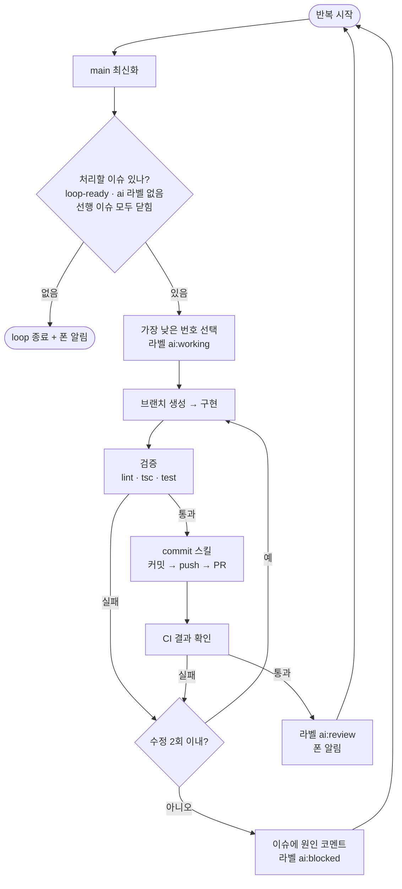
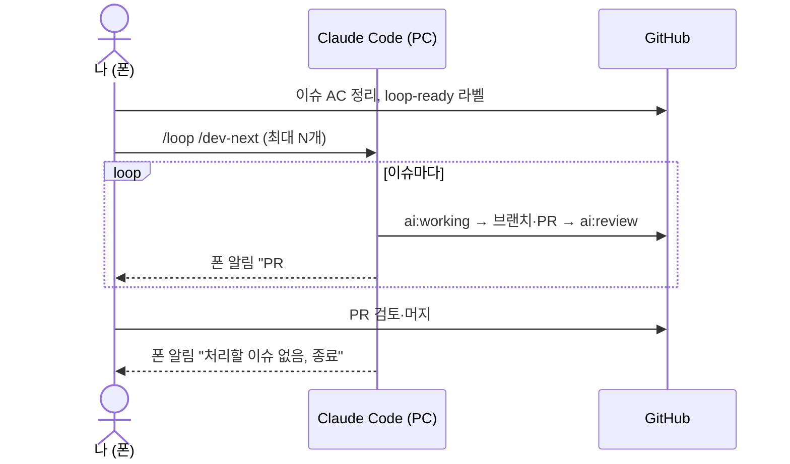

# 리포트: `/loop` 활용 장시간 AI 개발 체계 검토

- 작성: 2026-09-17
- 상태: **제안** (아직 구현하지 않음, 8장 준비 작업 승인 필요)
- 관련: [개발 진행 계획](2026-09-17-dev-plan.md), `CLAUDE.md` 작업 방식

## 1. 한눈에 보기

AI 개발은 세 가지 모드로 운영한다. **기본은 대화형**, loop는 "맡겨도 되는 일"이 쌓였을 때만 켠다.

| 모드 | 언제 | 사람이 하는 일 | 필요 조건 |
|---|---|---|---|
| **대화형** (기본) | 설계 판단·실기기 확인·보안이 걸린 이슈 | 매 단계 지시·확인 | PC 세션 + 폰 Remote Control |
| **loop** | AC가 명확한 이슈가 여러 개 쌓였을 때 | 시작 명령 → PR 검토·머지 → 막힌 이슈 답변 | 위 조건 + `loop-ready` 라벨 + CI |
| **@claude** (예비) | PC가 꺼져 있거나 급할 때 | 이슈에 `@claude` 멘션 | Claude GitHub App 설치 (미설정) |

## 2. `/loop`이란
- Claude Code에서 **같은 지시를 반복 실행**하는 명령이다.
  - `/loop 30m <지시>` → 30분마다 실행
  - `/loop <지시>` → 간격을 AI가 스스로 정함 (한 작업 끝나면 곧바로 다음)
- **PC의 Claude Code 세션이 살아 있는 동안만** 돈다. 세션을 끄거나 PC가 절전에 들어가면 멈춘다.
- 반복마다 같은 대화에 이어서 실행되므로, 대화가 길어지면 이전 내용이 자동 요약된다. → **진행 상태는 대화가 아니라 GitHub(라벨·이슈 코멘트·PR)에 기록**해야 끊겨도 이어갈 수 있다.

## 3. 핵심 원칙: 1회 반복 = 이슈 1개 = PR 1개

- 이슈 선택 조건
  1. Open + `loop-ready` 라벨
  2. `ai:working` / `ai:review` / `ai:blocked` 라벨 없음
  3. 본문의 **선행 이슈가 모두 닫힘**(= PR 머지됨)
- 이슈 번호가 낮은 것부터 처리한다.

## 4. 상태 라벨 (신규 제안)
| 라벨 | 의미 | 사람이 할 일 |
|---|---|---|
| `ai:working` | AI가 작업 중 | 없음 |
| `ai:review` | PR 올라감, CI 통과 | 폰에서 PR 검토 → 머지 |
| `ai:blocked` | AI가 멈춤, 이슈 코멘트에 이유 기록 | 코멘트 읽고 답변 → 라벨 제거 |

- 세션이 끊겨도 `ai:working` 라벨을 보고 해당 브랜치에서 이어간다.
- GitHub 이슈 목록에서 `label:ai:review`로 **내가 볼 PR만** 걸러볼 수 있다.

## 5. 가장 큰 병목: 머지 대기
머지는 사람이 하므로, AI가 #3 PR을 올려도 머지 전까지 #4(선행 #3)는 시작할 수 없다.

| 방식 | 설명 | 판단 |
|---|---|---|
| **A. 독립 이슈끼리 묶기** | 선행 이슈가 이미 머지된 이슈들만 `loop-ready`로 지정 | **초기 추천.** 단순하고 충돌 없음 |
| B. 쌓아올리기(stacked PR) | 머지 안 된 PR 브랜치 위에서 다음 이슈 작업 | 앞 PR 수정 시 뒤 PR 전부 재작업. 익숙해진 뒤 검토 |

- 현재 계획에서 방식 A로 가능한 첫 묶음: **#2 머지 후 #3 + #5** (둘 다 #2만 선행)

## 6. 안전장치
### 멈춤 조건 (AI가 스스로 멈추고 `ai:blocked`)
- 검증 실패를 수정 2회 안에 못 고침
- AC가 모호하거나 서로 충돌함
- ADR에 없는 새 라이브러리가 필요함
- 비밀 값·인증·보안 관련 코드를 설계해야 함
- 이슈 범위 밖 파일을 크게 고쳐야 함

### 설정으로 강제하는 장치 (AI 판단에 의존하지 않음)
| 장치 | 막는 것 | 상태 |
|---|---|---|
| GitHub 브랜치 보호 (main PR 필수·CI 필수) | main 직접 push, CI 실패 머지 | 미설정 (D3) |
| Push protection | 비밀 값 push | ✅ 설정됨 |
| CI (lint·tsc·test) | 깨진 코드 | #2에서 구축 |
| `.claude/settings.json` 권한 규칙 | 허용 목록 밖 위험 명령 (예: `git push --force`, 패키지 전역 설치) | 미설정 |

### 실행 제한
- loop 시작 지시에 **최대 처리 개수** 또는 **시간**을 명시한다. 예: "loop-ready 이슈 최대 3개".

## 7. 사람의 역할 (폰 기준)

- **시작 전**: PC 절전 모드 끄기, 대상 이슈 AC 점검
- **진행 중**: 알림 오면 PR 검토·머지, `ai:blocked` 이슈에 답변
- **끝난 뒤**: 대화형으로 복귀, `journal` 스킬로 일지 작성

## 8. 도입 준비 작업 (승인 후 진행)
| 순서 | 작업 | 산출물 |
|---|---|---|
| 1 | #2 CI 완료 | `.github/workflows/ci.yml` |
| 2 | main 브랜치 보호 규칙 적용 | GitHub 설정 |
| 3 | `ai:working` / `ai:review` / `ai:blocked` 라벨 생성 | GitHub 라벨 |
| 4 | 작업 이슈 템플릿·기존 이슈에 `선행 이슈` 항목 추가 | `task.yml`, #1~#9 본문 |
| 5 | 1회 반복 절차를 스킬로 작성 | `.claude/skills/dev-next/SKILL.md` |
| 6 | 권한 허용 목록 정리 | `.claude/settings.json` |
| 7 | #3 + #5로 시범 운영 → 결과를 이 문서에 반영 | 리포트 갱신 |

## 9. 한계와 주의
- **실기기 확인은 AI가 못 한다.** "Expo Go에서 표시" 같은 AC가 있는 이슈(#1, #7)는 loop 대상에서 제외하거나, 실기기 확인을 PR 검토 단계로 넘긴다.
- **사용량 한도**: 장시간 loop는 Claude 사용량을 빠르게 소모한다. 최대 처리 개수를 정해 두는 이유다.
- **@claude(GitHub Actions)**: Claude GitHub App 설치와 저장소 secret 등록이 필요하고, Public 저장소에서 누구나 멘션할 수 있으므로 **작성자 제한 설정**이 필수다. 필요해지면 별도 이슈로 진행한다.

## 갱신 (2026-09-17)
- `CLAUDE.md`에 **머지 등급**을 도입했다. 🟢(문서만 변경 등)은 Claude가 자체 머지하므로, 5장의 머지 병목은 🟡 이상 PR에만 남는다.
- **Stop 훅**(`.claude/hooks/stop-vcs-check.js`)이 턴 종료 시 커밋·push·일지 누락을 막는다. loop 반복마다 형상관리가 빠지지 않게 하는 장치로도 쓰인다.
- 8장 5번 `dev-next` 스킬은 아직 미작성이다.
