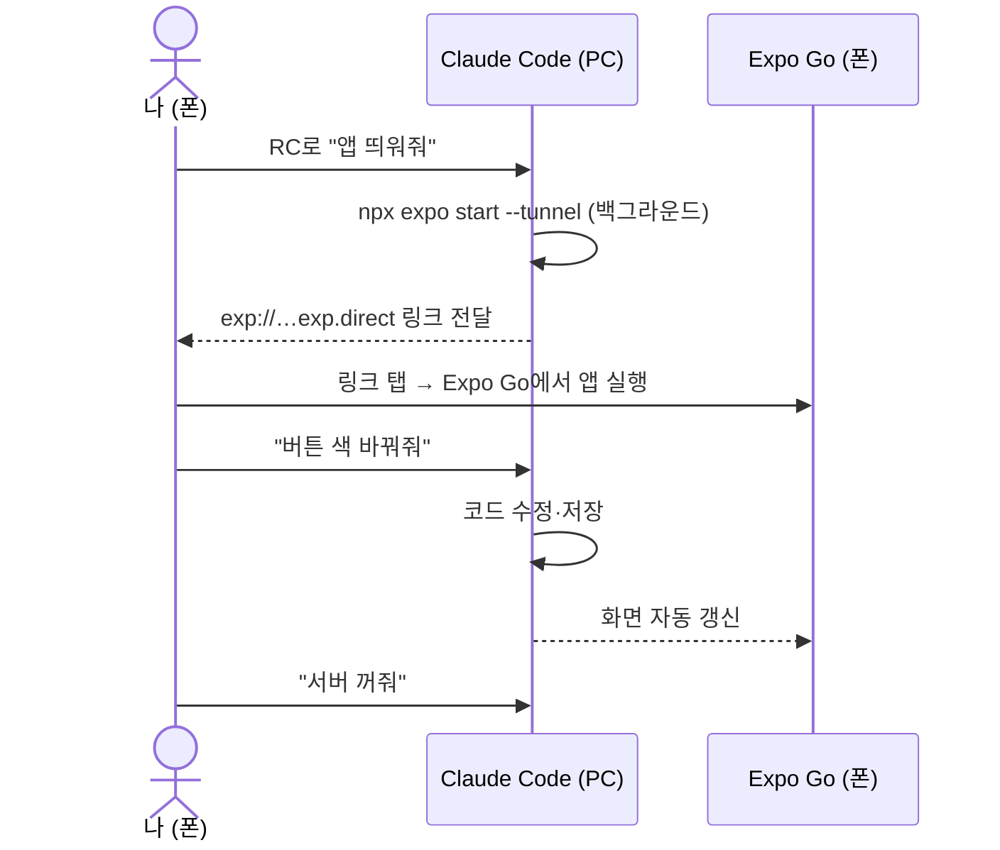

# 리포트: 모바일 중심 개발 체계에서 앱 실행 화면 확인 방법

- 작성: 2026-09-17
- 상태: **제안** (8장 결정 후 #1·#2에 반영)
- 전제: 개발은 PC의 Claude Code가 하고, 사람은 폰에서 Claude 앱(Remote Control, 이하 RC)과 GitHub 모바일 앱으로 지시·검토한다.

## 1. 요약
- PC 앞이라면 `npx expo start` → 터미널 QR 스캔 → Expo Go로 끝이지만, **폰만 들고 있으면 QR을 스캔할 수 없고, 집 밖이면 같은 Wi‑Fi도 아니다.**
- 그래서 확인 방법을 **상황별 3가지**로 나눠 쓴다.

| 방법 | 언제 | PC 필요 | 코드 수정 즉시 반영 | 준비 |
|---|---|---|---|---|
| **A. RC + tunnel 개발 서버** | 지금 작업 중인 화면을 바로 볼 때 | 켜져 있어야 함 | ✅ (저장 즉시) | `@expo/ngrok` 설치 |
| **B. PR 미리보기 (EAS Update)** | PR 머지 전에 결과 확인 | 불필요 | ❌ (PR push마다 갱신) | Expo 계정·토큰, CI 설정 |
| **C. 설치형 개발 빌드** | Expo Go로 안 되는 네이티브 기능이 생겼을 때 | 불필요 | 방법 A·B와 결합 | EAS Build, (iOS는 유료 개발자 계정) |

- **추천**: #1에서 **A**로 시작 → #2 CI 구축 시 **B** 추가 → 네이티브 모듈이 필요해지면 **C** 검토(ADR).

## 2. 기본 개념 (PC 개발과 비교)

| 구분 | PC에서 개발할 때 | 이 프로젝트 (폰에서 지시) |
|---|---|---|
| 개발 서버 실행 | 내가 터미널에서 `npx expo start` | Claude가 PC에서 백그라운드로 실행 |
| 폰 연결 | 터미널 QR을 폰 카메라로 스캔 | QR 대신 **링크(URL)를 채팅으로 받아 탭** |
| 네트워크 | PC와 폰이 같은 Wi‑Fi (LAN, 기본값) | 어디서든 접속되도록 **tunnel** 사용 |
| 수정 반영 | 파일 저장 시 폰 화면 자동 갱신 | 동일 (Claude가 저장하면 자동 갱신) |

- **Expo Go**: 앱스토어/플레이스토어에서 받는 "Expo 앱 실행기". 내 앱을 설치하지 않고도 개발 서버나 업데이트 링크를 열어 실행한다.
  - 스토어 버전은 **최신 SDK만 지원**한다(2026-09 기준 SDK 57). → #1 스캐폴딩 시 최신 SDK를 써야 한다.
  - Expo Go에 포함되지 않은 네이티브 라이브러리는 쓸 수 없다. 현재 계획(ADR-0004)은 모두 Expo Go 호환이다.
- **tunnel**: 개발 서버를 ngrok 공개 주소(`…exp.direct`)로 내보내 **인터넷만 되면 어디서든** 접속하게 한다. LAN보다 느리고 가끔 연결이 끊길 수 있다.

## 3. 방법 A — RC + tunnel 개발 서버 (기본)

- **사용법**: "앱 띄워줘" → Claude가 링크를 보내면 폰에서 탭 → 확인 후 "서버 꺼줘"
- **장점**: 수정 → 확인 반복이 가장 빠르다. 추가 비용 없음.
- **한계**
  - PC와 Claude Code 세션이 켜져 있어야 한다.
  - 터미널 QR은 폰에서 스캔할 수 없으므로 **링크로 연다**. 채팅 앱에서 `exp://` 링크 탭이 Expo Go로 바로 연결되는지는 #1에서 확인이 필요하다. 안 되면 대안(링크를 폰 브라우저에 붙여넣기 등)을 찾아 이 문서에 반영한다.
  - 오류 화면(빨간 화면)이 뜨면 스크린샷을 RC 채팅에 첨부하면 Claude가 원인을 본다.
- **준비**: `npm i -g @expo/ngrok` (#1에서 1회 설치)

## 4. 방법 B — PR 미리보기 (GitHub 모바일에서 확인)

- **동작**: Expo 공식 GitHub Action(`expo/expo-github-action/preview`)이 PR마다 `eas update`로 업데이트를 올리고, **PR에 QR 코드와 링크를 코멘트로 단다.**
- **사용법**: GitHub 모바일에서 PR 열기 → 코멘트의 링크 탭 → 앱 확인 → 머지 판단
- **장점**: **PC가 꺼져 있어도 된다.** AI가 자체 머지한 변경도 main 채널 업데이트로 사후 확인할 수 있다.
- **준비**
  1. Expo 계정 생성 (사람)
  2. Expo 액세스 토큰 발급 → GitHub 저장소 Secret `EXPO_TOKEN`으로 등록 (사람, 토큰은 채팅에 붙여넣지 않음)
  3. `eas.json`, `expo-updates` 설정 + 워크플로에 preview 단계 추가 (Claude, #2)
- **확인 필요**: Expo 문서상 업데이트 QR은 Expo Go와 개발 빌드 모두 지원하지만, PR 미리보기 가이드는 개발 빌드 사용을 전제로 설명한다. **#2에서 Expo Go로 열리는지 시범 확인**하고, 안 되면 방법 C와 함께 쓴다.
- **비용**: EAS 무료 플랜 한도 안에서 시작한다(업데이트·빌드 한도는 expo.dev 요금 페이지에서 확인).

## 5. 방법 C — 설치형 개발 빌드 (필요해질 때)
- Expo Go 대신 **내 앱 전용 실행기**를 폰에 설치한다. Expo Go에 없는 네이티브 라이브러리도 쓸 수 있다.
- EAS Build가 클라우드에서 빌드하므로 PC에 Android Studio나 Xcode가 없어도 된다.

| | Android | iOS |
|---|---|---|
| 설치 | EAS Build가 만든 **APK 링크를 폰에서 열어 설치** | Ad hoc 배포: **유료 Apple Developer 계정** 필요, 기기 UDID 등록, 새 기기 추가 시 재빌드 |
| 비용 | 무료 (EAS 무료 빌드 한도 내) | Apple Developer 연회비 |

- 도입 시점: Expo Go 비호환 라이브러리가 필요하거나(예: MMKV), 방법 B가 Expo Go에서 동작하지 않을 때 → ADR 작성

## 6. 보조 수단
| 수단 | 용도 | 한계 |
|---|---|---|
| RC 채팅에 **폰 스크린샷 첨부** | 오류 화면·레이아웃 문제 전달 | 사람이 찍어야 함 |
| 웹 빌드(`expo start --web`) | 레이아웃만 빠르게 확인 | 네이티브 동작과 다르고 secure-store 미지원 → 참고용 |
| Claude가 컴포넌트 테스트(RNTL)로 자체 검증 | 머지 전 자동 확인 | 실제 화면 모양은 못 봄 |

## 7. 개발 흐름에 반영
| 이슈 | 반영 내용 |
|---|---|
| #1 스캐폴딩 | 방법 A 시범: tunnel 실행, 링크로 Expo Go 열기 → AC "Expo Go에서 기본 화면 표시" 확인 |
| #2 품질·CI | 방법 B 추가: preview 단계, `EXPO_TOKEN` 등록 → Expo Go 동작 여부 기록 |
| 실기기 AC가 있는 이슈 (#1, #7 등) | PR 코멘트 링크(방법 B)로 사람이 확인 후 머지 |

## 8. 결정 필요 사항
| # | 결정 | 필요 시점 |
|---|---|---|
| M1 | 사용하는 폰 OS (Android / iOS) — 방법 C 가능 여부와 비용이 달라짐 | #1 전 |
| M2 | Expo 계정 생성과 `EXPO_TOKEN` 등록 (사람만 가능) | #2 전 |
| M3 | `@expo/ngrok` 전역 설치 허용 | #1 착수 시 |

## 참고
- Expo CLI (`--tunnel`, LAN): https://docs.expo.dev/more/expo-cli/
- 개발 빌드: https://docs.expo.dev/develop/development-builds/introduction/
- PR 미리보기 GitHub Action: https://docs.expo.dev/eas-update/github-actions/
- 업데이트 QR 코드: https://docs.expo.dev/more/qr-codes/
- 내부 배포 (APK / iOS ad hoc): https://docs.expo.dev/build/internal-distribution/
- Expo Go: https://expo.dev/go

## 갱신 (2026-09-17) — 방법 A 시범 결과 (#1, PR #12)
- **결과: 성공.** 폰 Expo Go에서 기본 화면 표시를 확인했다.
- 확정된 절차
  1. Claude가 `npx expo start --tunnel --go`를 백그라운드로 실행
  2. PC에서 `npx expo login` (별도 터미널, 1회)
  3. 폰 Expo Go에서 같은 Expo 계정으로 로그인 → 개발 서버 목록에서 프로젝트 탭
- 3장의 "링크를 탭해 연다" 가정은 틀렸다. 사용자 폰의 Expo Go에는 URL 입력란이 없었다. **계정 로그인 방식이 기본**이다.
- 결정 사항 반영: M3(`@expo/ngrok`)은 전역 설치로 인식되지 않아 **프로젝트 개발 의존성**으로 설치. M2의 Expo 계정은 생성 완료(`EXPO_TOKEN`은 방법 B 도입 시 필요). M1(폰 OS)은 미정.
- 시행착오: [expo-go-remote-preview.md](../learning/expo-go-remote-preview.md)
