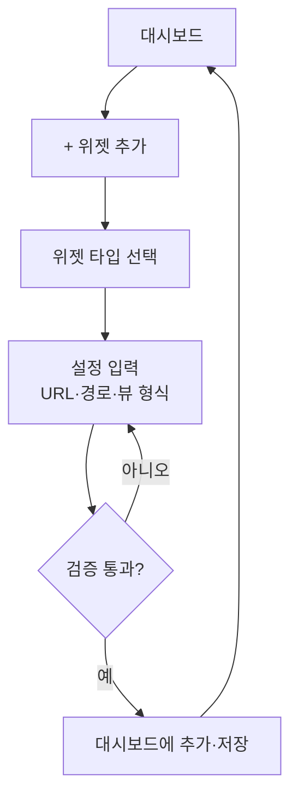
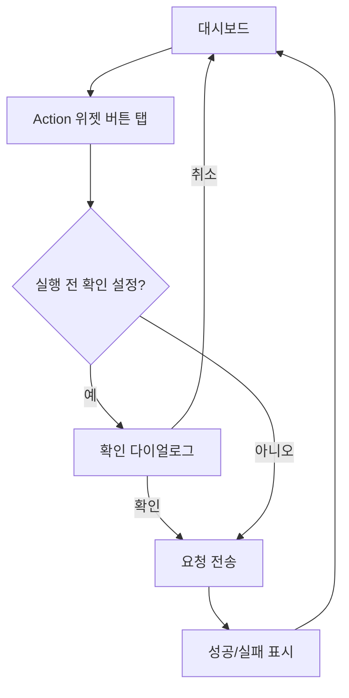
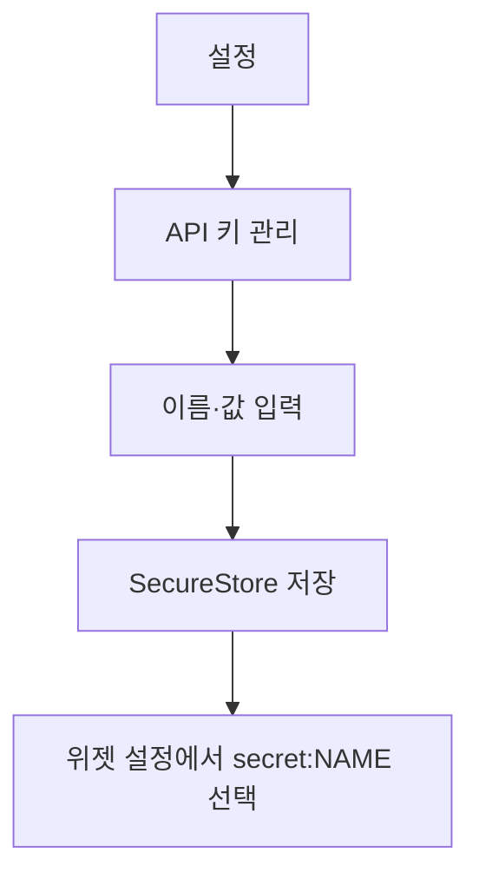

# User Flows

## UF-01 위젯 추가 (PRD-001, PRD-002)

```mermaid
flowchart TD
  A[대시보드] --> B[+ 위젯 추가]
  B --> C[위젯 타입 선택]
  C --> D[설정 입력<br/>URL·경로·뷰 형식]
  D --> E{검증 통과?}
  E -- 아니오 --> D
  E -- 예 --> F[대시보드에 추가·저장]
  F --> A
```

## UF-02 데이터 전송 위젯 실행 (PRD-004)

```mermaid
flowchart TD
  A[대시보드] --> B[Action 위젯 버튼 탭]
  B --> C{실행 전 확인 설정?}
  C -- 예 --> D[확인 다이얼로그]
  D -- 취소 --> A
  D -- 확인 --> E[요청 전송]
  C -- 아니오 --> E
  E --> F[성공/실패 표시]
  F --> A
```

## UF-03 API 키 등록 (PRD-006)

```mermaid
flowchart TD
  A[설정] --> B[API 키 관리]
  B --> C[이름·값 입력]
  C --> D[SecureStore 저장]
  D --> E[위젯 설정에서 secret:NAME 선택]
```
